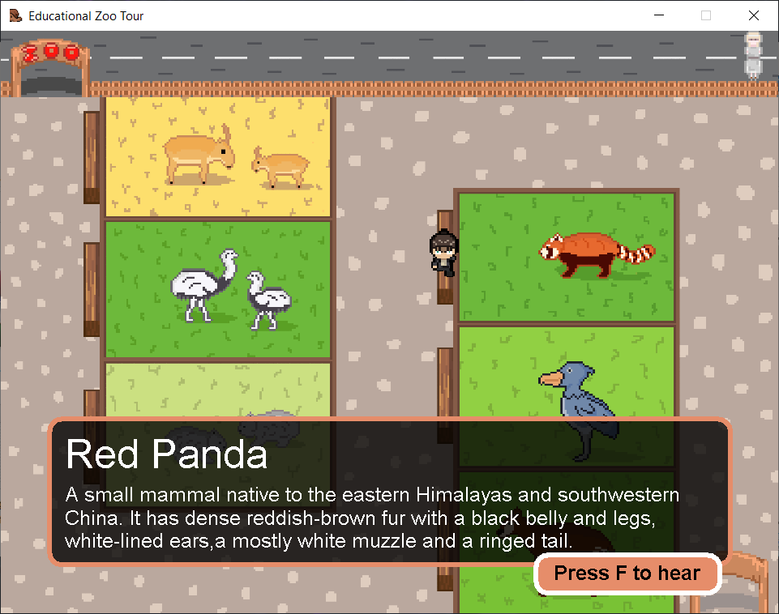

# Educational Zoo Tour Game/App

## What is this?
Educational gampe/app tentang binatang-binatang yang jarang
dijumpai di kebun binatang pada umumnya.

## How many features do this program has?
- Bermain sebagai pengunjung dan dapat bisa
  mengeksplorasi kebun binatang sepuasnya.
- Terdapat beberapa hewan yang jarang ditemui di bonbin biasa
- Dapat mengelilingi kebun binatang secara bebas.
- Dapat berinteraksi dengan setiap area binatang yang dikunjungi.
- Setiap interaksi akan mengeluarkan suara hewan yang dikunjungi.

## Credits
- Lead Programmer: Andhika
- Lead Concept & Designer: Rangga
- Soundtrack: AOT S2 OST, Hiroyuki Sawano
- Sound Effects: Mojang Studios, Minecraft

## Change Logs
All the changes we made throughout the game development

### 06/06/22 - Intial Commit
- Basic game functions (Graphics, Player movement, Sound trigger, Soundtrack).

#### 9/06/22 - UI Update
- Added information UI with animal title and their descprition,
- Added a new feature: display information UI whenever player is on a certain place
- Added interact button UI
- New Character Design
- Updated map
- Updated window title

#### 10/06/22 - More Changes
- Added new app icon
- Added "Beast"
- Updated map

#### 14/06/22 - Added Animal Sounds
- Added 6 new animal sounds (okapi, red panda, rhea, saiga, shoebill, wombat)
- Updated character design
- Simplification on how sounds are played for code readability
- Adjusted interact button UI alignment
- Updated app window icon

### 15/06/22 - FIRST RELEASE!! v1.0
- Updated map
- Fix stretched player character
- Added player collision on animal cage and street fences
- All animal interaction UI & sounds are enabled
- Moved in-game exit location to the bottom right corner of the screen

#### 15/06/22 - Changes and Bug fix v1.1
- Squashed a bug where the player can enter the wombat cage
- Updated game soundtrack
- Adjusted collision on some cages

#### 16/06/22 - Changes v1.1.1
- Player now exit the game immediately after entering the exit location
- Changed credits for video report purposes
- Adjusted volume and length of the soundtrack

## Screenshot(s)

