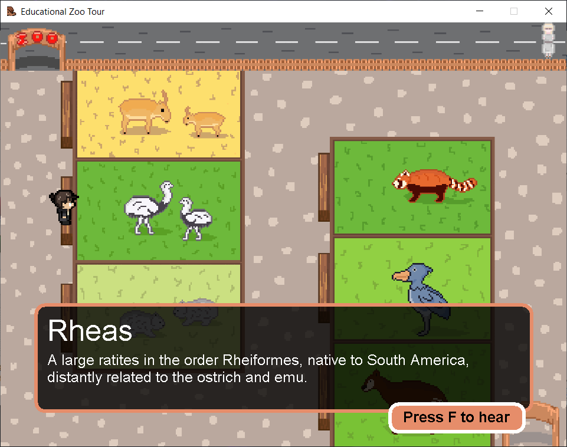

# Educational Zoo Tour Game/App

## What is this?
Educational gampe/app tentang binatang-binatang yang jarang
dijumpai di kebun binatang pada umumnya.

## How many features do this program has?
- Bermain sebagai pengunjung dan dapat bisa
  mengeksplorasi kebun binatang sepuasnya.
- Terdapat beberapa hewan yang jarang ditemui di bonbin biasa
- Dapat mengelilingi kebun binatang secara bebas.
- Dapat berinteraksi dengan setiap area binatang yang dikunjungi.
- Setiap interaksi akan mengeluarkan suara hewan yang dikunjungi.

##Change Logs

####06/06/22 - Intial Commit
- Basic game functions (Graphics, Player movement, Sound trigger, Soundtrack).

####06/06/22 - Added readme.

####09/06/22 - UI Update
- Added information UI with animal title and their descprition, 
- Added a new feature: display information UI whenever player is on a certain place
- Added interact button UI
- New Character Design
- Updated map
- Updated window title

####06/06/22 - Updated readme and screenshots.

## Credits
- Lead Programmer: nope.
- Lead Concept & Designer: sekiper
- Soundtrack: C418, Minecraft
- Sound Effects: Minecraft

## Screenshot(s)
